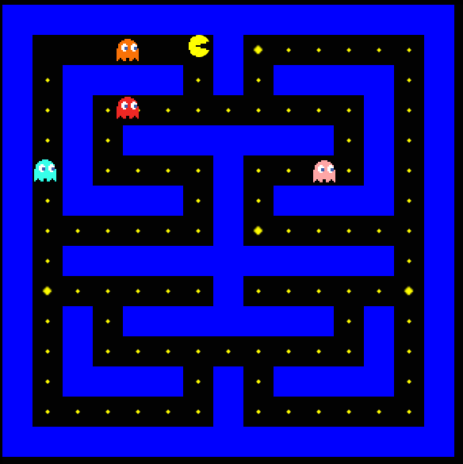
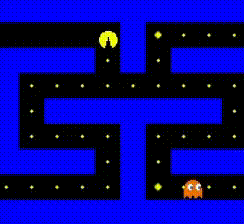
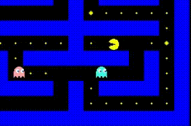

## 2 - Demonstração Visual

Abaixo estão alguns registros do jogo em funcionamento, mostrando suas principais mecânicas.

### Mapa do Jogo

### Movimentação do Personagem

---

### Interações, Power Pill e Modo Assustado

---

As imagens demonstram o funcionamento da movimentação em grid, o sistema de colisões e a mudança de estado dos fantasmas durante o modo assustado.